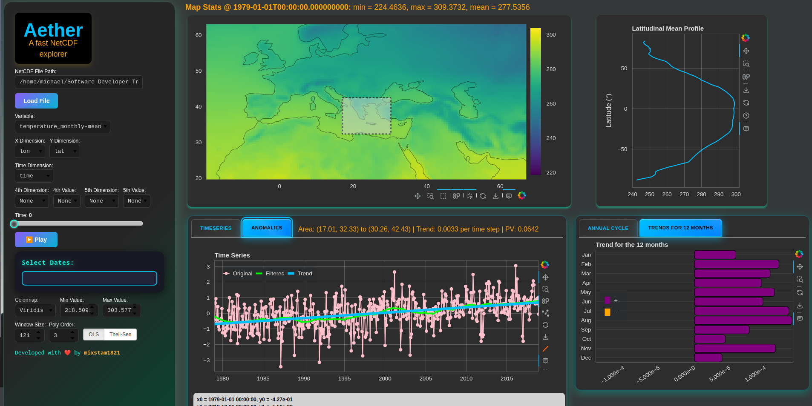
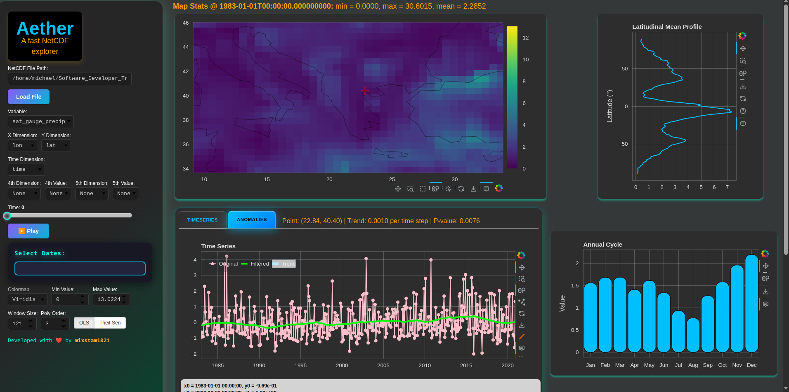
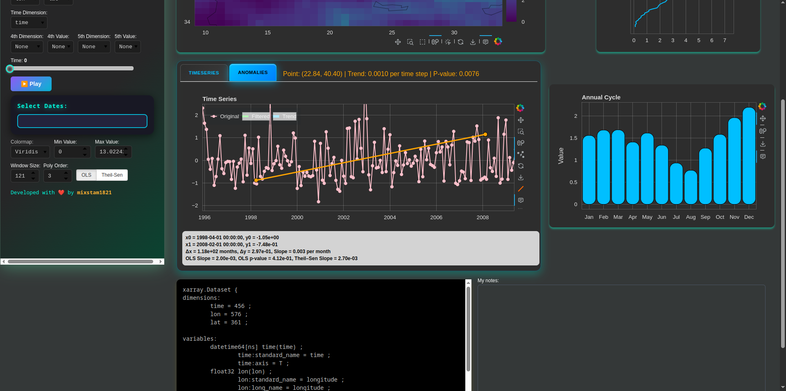
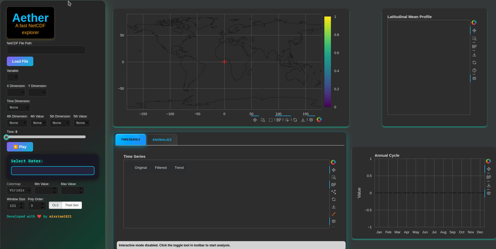
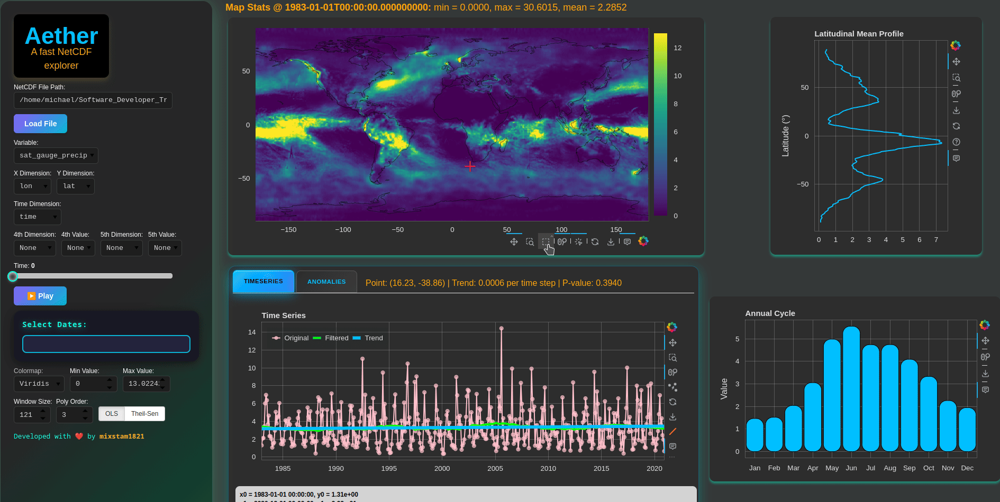
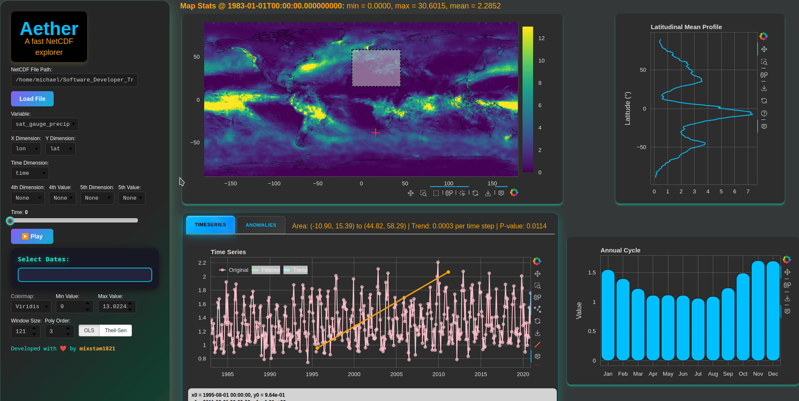
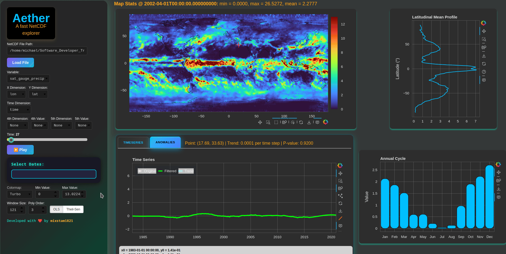
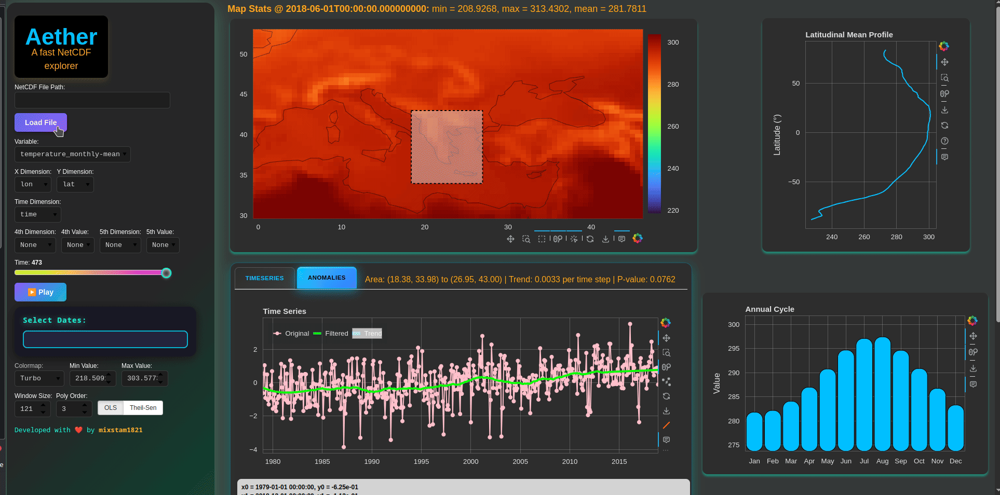
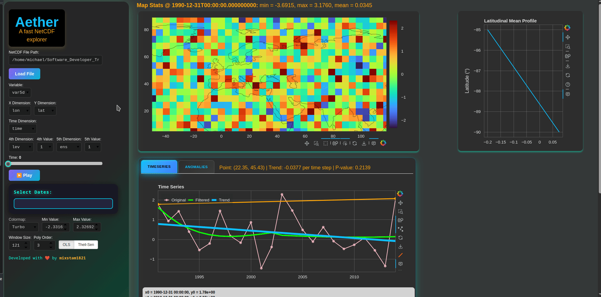

# Aether: Fast NetCDF Explorer

_Aether_ is a modern, high-performance interactive explorer for **NetCDF datasets**, built with **Bokeh**, **Xarray**, and **SciPy**.  

This application is highly inspired by NASA’s Panoply!

NetCDF files are a common file type in climate science, and Aether is an excellent app for students and researchers for quick exploration of the .nc files.

More specifically, Aether lets you:

Instantly visualize huge NetCDF datasets—no lag
Pick variables & dimensions with a click (supports 4D/5D)
Explore maps, timeseries, anomalies, and trends right in your browser
Click anywhere for instant timeseries & anomaly analysis (with built-in trend lines)
Drag, box-select, zoom, animate, and analyze—real time!
Full info panels, custom colormaps, and robust color scaling

## What new Aether brings to the table?

- Interactive map (zoom, pan, selection).
- Time series and their core statistics by clicking or selecting a region.
- Animations.
- Custom trend detection.

---

## Update 03.07.2025
- Analysis for the trends of the 12 months of the year has been added as a bar plot.


## 🚀 Features

- **Fast NetCDF File Loading** (local path)
- **Interactive Variable & Dimension Selection**
  - Supports auto-detection of time, 4th, and 5th dims
  - Spatial and non-spatial dimension control
- **Instant Heatmap Viewer**
  - Choose colormaps (Viridis, Plasma, RdBu, more)
  - Robust color scaling (1st–99th percentile by default)
  - Live min/max spinners and palette switching
- **Click-to-Explore Timeseries**
  - Click any point on the map for full temporal analysis
  - Dual timeseries tabs: _raw values_ & _anomalies_
  - Savitzky-Golay filtering, OLS/Theil-Sen trend lines, p-values
- **Interactive Area Averaging**
  - Drag/box-select region to view mean timeseries/trends
- **Annual Cycle Analysis**
- **Latitudinal Mean Profile** (area-weighted)
- **Full dataset info panel**
- **Notes area for in-app documentation**

---

## 🎥 Screenshots and Instructions
<!-- Insert images or GIFs of the UI here if possible -->




- Copy the full filepath (/home/michael/myfile.nc) or right click on .nc file select copy and then just paste in the input field (e.g. file:///home/michael/myfile.nc).
- Press the button Load File and the file will load.
- By default Ather understand the common lat lon time dimensions, but please ensure that all the dimensions and the variable are that you want to investigate.


- After the file loading, you can interact with the map and explore the distribution of the variable.
- By clicking on a specific point or selecting a box area you can get the corresponding spatial-averaged timeseries. Anomalies of these timeseries are also computed.
- Linear trend line and low pass filtered data (Savitzky-Golay filter) are applied to the timeseries.


- The user can select a specific range of the timeseries' date range and get the corresponding trend.
- Animation of the map, select a specific data or a time slider are also supported.
- The user can change the colormap and its min max values.




-- The annual cycle will appear only with monthly data.

---

## ⚡ Quickstart

1. **Clone & create environment**
    ```bash
    git clone https://github.com/mixstam1821/Aether.git
    cd Aether
    ```

2. **Run the app**
    ```bash
    uv run bokeh serve --show aether.py
    ```

3. **Open in browser**
    - Enter your local NetCDF file path (e.g. `/Users/you/data/myfile.nc`)
    - Explore: Select variables, dimensions, slice by time, click any pixel for full timeseries!

---

## Using Docker

```bash
git clone https://github.com/mixstam1821/Aether.git
cd Aether
docker build -t aether-app .
docker run -p 9285:9285 -v /path/to/your/netcdf/data:/data aether-app
```

To test some netCDFs, please download them via the links in assets/links.txt.

## 📦 Requirements

- Python 3.8+
- Recommended install:
    ```bash
    pip install bokeh xarray numpy pandas scipy matplotlib cartopy shapely cftime
    ```
- For advanced usage:  
  `jupyterlab`, `ipython` (optional, for interactive notebook usage)

---

## 🧭 Usage Tips

- **File path:** Absolute local path required (use `/path/to/your/file.nc`)
- **Variable & dimension selection:** Dropdowns auto-populate after loading
- **Box selection:** Drag rectangle on heatmap to see area-averaged timeseries
- **Colormap & scaling:** Use palette and min/max for best visual contrast
- **Trend analysis:** Drag endpoints on timeseries to fit OLS or Theil–Sen (toggle tool in plot toolbar)
- **Notes:** Use the notes widget for dataset annotations or workflow logs

---

## 👨‍💻 Credits

Created with ❤️ by [mixstam1821](https://github.com/mixstam1821)

---

## 🔗 License

MIT License (see [LICENSE](./LICENSE))

---

## 🌊 Example Data

Try with freely available climate/earth science datasets:

- [NOAA NCEP Reanalysis](https://psl.noaa.gov/data/gridded/data.ncep.reanalysis.html)
- [CMIP6 output](https://esgf-node.llnl.gov/projects/cmip6/)
- [Copernicus ERA5](https://cds.climate.copernicus.eu/cdsapp#!/dataset/reanalysis-era5-single-levels-monthly-means)

---

## 🛠️ Development

- PRs, issues, and forks welcome!
- For custom UI/feature requests, open a GitHub issue

---

**Enjoy data exploration at the speed of thought—powered by Aether!**

---
```bash
In Greek mythology, Aether (/ˈiːθər/; Ancient Greek: Αἰθήρ (Brightness) pronounced [ai̯tʰɛ̌ːr]) is the personification of the bright upper sky. According to Hesiod, he was the son of Erebus (Darkness) and Nyx (Night), and the brother of Hemera (Day).

Hymn to Aether
The Orphic Hymns (2nd or 3rd centuries AD?) are a collection of eighty-seven poems addressed to various deities or abstractions. The fifth Orphic Hymn, which prescribes an offering of saffron, addresses Aether as follows:

Yours are Zeus' lofty dwelling, endless power too;
of the stars, of the sun, and of the moon you claim a share.
O tamer of all, O fire-breather, O life's spark for every creature,
sublime Ether, best cosmic element,
radiant, luminous, starlit offspring,
I call upon you and I beseech you to be temperate and clear.

```
